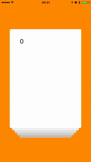

# BSStackView



BSStackView is available through [CocoaPods](http://cocoapods.org). To install
it, simply add the following line to your Podfile:

```ruby
pod "BSStackView"
```
or install manually by downloading the files from GitHub and then use
```ObjC
#import "BSStackView.h"
```

## Usage

## To run the example project, clone the repo, and run `pod install` from the Example directory first.

Add the below reference to the @interface method in the header file(.h)
```ObjC
@property (nonatomic, strong) IBOutlet BSStackView *stackView;
```

Initialize the BSStackView in the Implementation File (.m)
```ObjC
self.stackView.swipeDirections = UISwipeGestureRecognizerDirectionLeft | UISwipeGestureRecognizerDirectionRight | UISwipeGestureRecognizerDirectionUp | UISwipeGestureRecognizerDirectionDown;
self.stackView.forwardDirections = UISwipeGestureRecognizerDirectionRight | UISwipeGestureRecognizerDirectionUp;
self.stackView.backwardDirections = UISwipeGestureRecognizerDirectionLeft | UISwipeGestureRecognizerDirectionDown;
self.stackView.changeAlphaOnSendAnimation = YES;
[self.stackView configureWithViews:views];
self.stackView.delegate = self;
```

Customize constraints
```ObjC
self.stackView.contraintsConfigurator.top = 20.;
self.stackView.contraintsConfigurator.bottom = 50.;
self.stackView.contraintsConfigurator.leading = 10.;
self.stackView.contraintsConfigurator.trailing = 10.;
[self.stackView configureWithViews:views];
```

## Requirements
  * iOS 8.0 or higher
  * ARC

## Author

iBlacksus, iblacksus@gmail.com

## License

BSStackView is available under the MIT license. See the LICENSE file for more info.
